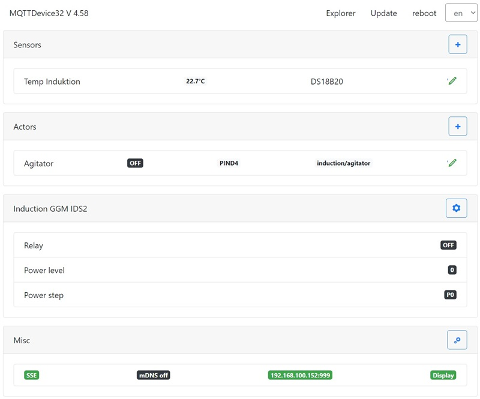

# MQTTDevice32pIO

MQTTDevice32 ist ein Arduino Sketch für den Wemos ESP8266 D1 mini und den ESP32 D1 mini. Mit dem MQTTDevice32pIO können Sensoren, Aktoren und das Induktionskochfeld GGM IDS2 per WLAN über einen MQTTBroker (bspw. mosquitto) mit [CraftBeerPi V4](https://github.com/PiBrewing/craftbeerpi4) verbunden werden.

## ✅ Funktionen

* Web Interface (WebIf)
* Backup und Restore der Konfiguration
* Server Sent Events (SSE) für WebClients
* Temperatursensoren
  * Dallas DS18B20 Sensoren
    * Suchfunktion für Dallas DS18B20 OneWire Sensoren
  * PT100 und PT1000 Sensoren
    * MAX31865 Amplifyer
  * MQTTDevice32 unterstützt bis zu 6 Sensoren
  * MQTTDevice4 supports unterstützt bis zu 3 Sensoren
* Aktoren
  * GPIO Auswahl
  * belegte GPIOs werden in der Auswahl ausgeblendet
  * GPIO invertieren
  * Einfaches PWM: Aktoren können auf 0 bis 100% Leistung eingestellt werden. Das MQTTDevice takten im Zyklus von 1000ms
  * MQTTDevice32 unterstützt bis zu 15 Aktoren
  * MQTTDevice4 unterstützt bis zu 10 Aktoren
* Induktionskochfeld
  * Induktionskochfeld GGM IDS2 wird direkt gesteuert
* Nextion HMI Touchdisplay Unterstützung
* Akkustische Signale
* WebUpdate Firmware
* DateiUpdate Firmware
* mDNS Support
* Event handling
* Dateiexplorer
* Unterstützung für versch. Sprachen

## 💻 Installation

* Firmware.zip entpacken
* Doppelklick auf Flashen.cmd

Das Script flashen.cmd verwendet [esptool](https://github.com/espressif/esptool) (im ZIP Archiv enthalten).

## 📚 Anleitung und Dokumentation

Beschreibung & Anleitung: [Anleitung](https://innuendopi.gitbook.io/mqttdevice32/)

## 🗺️ Multilingual

Das MQTTDevice unterstützt nahezu beliebig viele Sprachen. Jede Sprache hat eine eigene Sprachdatei. Die Sprachdateien im JSON Format sind im data Ordner gespeichert.

_Unterstützte das Projekt und übersetze das MQTTDevice in eine neue Sprache bzw. erweitere vorhandene Sprachdateien!_

## 💠 Pin-Belegung

ESP8266 D1 mini

| Bezeichner |   GPIO   |  Input  |  Output  | Beschreibung |
| ---------- | -------- | ------- | -------- | ------------ |
|     D0     |  GPIO026 |   ok    |   ok     | MAX31865 MOSI (High at boot, no int, no PWM) |
|     D1     |  GPIO022 |   ok    |   ok     | SCL Display, MAX31865 MISO  |
|     D2     |  GPIO021 |   ok    |   ok     | SDA Display, MAX31865 CLK  |
|     D3     |  GPIO017 |   ok    |   ok     | DS18B20 sensors |
|     D4     |  GPIO016 |         |   ok     | MAX31865 CS0 (High at boot, onboard LED)|
|     D5     |  GPIO018 |   ok    |   ok     | IDS2 blue, MAX31865 CS1   |
|     D6     |  GPIO019 |   ok    |   ok     | IDS2 yellow, MAX31865 CS2 |
|     D7     |  GPIO023 |   ok    |   ok     | IDS2 white |
|     D8     |  GPIO005 |         |   ok     | Buzzer       |

The ESP32 D1 offers a pinout suitable for the ESP8266 (GPIO D0 to D8). The pin assignment shown is based on the ESP32 D1 Mini NodeMCU module from [AZ-Delivery](https://www.az-delivery.de/products/esp32-d1-mini)

ESP32 D1 mini

| Name | GPIO    | Input  | Output | notes                                         |
| ---------- | ------- | ------ | ------ | --------------------------------------------- |
| D0         | GPIO026 | ok     | ok     |                                               |
| D1         | GPIO022 | ok     | ok     |                                               |
| D2         | GPIO021 | ok     | ok     |                                               |
| D3         | GPIO017 | ok     | ok     | DS18B20                                       |
| D4         | GPIO016 | ok     | ok     |                                               |
| D5         | GPIO018 | ok     | ok     | GGM IDS Interrupt blue/green                  |
| D6         | GPIO019 | ok     | ok     | GGM IDS Command yellow                        |
| D7         | GPIO023 | ok     | ok     | GGM IDS Relay white                           |
| D8         | GPIO005 | ok     | ok     | Buzzer                                        |
| D9         | GPIO027 | ok     | ok     | SCLK                                          |
| D10        | GPIO025 | ok     | ok     | MISO                                          |
| D11        | GPIO032 | ok     | ok     | MOSI                                          |
| D12        | GPIO012 | (ok)   | ok     | TDI, boot fails if pulled high, strapping pin |
| D13        | GPIO004 | ok     | ok     | CS0                                           |
| D14        | GPIO000 | pullUp | (ok)   | must be low to enter flash mode               |
| D15        | GPIO002 | ok     | ok     | onboard LED, must be low to enter flash mode  |
| D16        | GPIO033 | ok     | ok     | CS1                                           |
| D17        | GPIO014 | ok     | ok     | CS2                                           |
| D18        | GPIO015 | ok     | ok     |                                               |
| D19        | GPIO013 | ok     | ok     |                                               |
||||||

Pins connected to onboard flash and not recommended for GPIO use: CMD (IO11), CLK (IO6), SD0/SDD (IO7), SD1 (IO8), SD2 (IO9) and SD3 (IO10)
